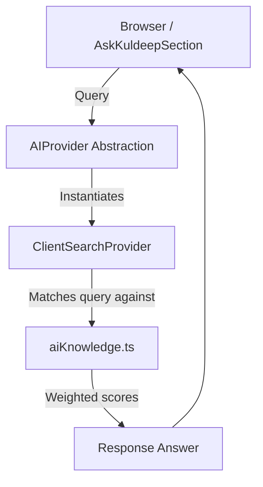
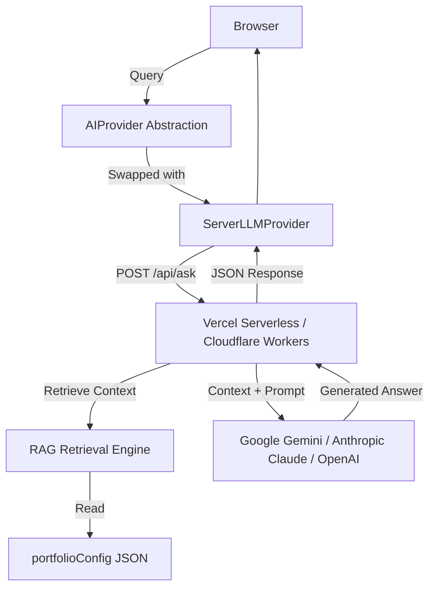

# AI Assistant Architecture & Future LLM Integration

This document outlines the architecture for the "Ask Kuldeep" AI portfolio assistant and the roadmap for transitioning from client-side keyword matching to a full LLM (Large Language Model) provider backend.

## Current Architecture (Phase 1)

Currently, the assistant runs entirely on the client side to minimize costs, latency, and operational complexity, while requiring zero external API keys.



### Components

1. **`AIProvider` Interface**: An abstraction layer defining a single unified method: `search(query: string): Promise<string>`.
2. **`ClientSearchProvider`**: Implements `AIProvider`. Performs local tokenization, weight scoring against question patterns, tags, and answers defined in `src/config/aiKnowledge.ts`, and returns the best-scoring response.
3. **`aiKnowledge.ts`**: Static JSON-like configuration structure containing high-fidelity, Q&A pairs directly derived from Kuldeep's resumes.

---

## Future Architecture (Phase 2): LLM / RAG Transition

When upgrading the portfolio to use an active LLM backend, the frontend code remains unchanged by swapping the underlying provider implementation to `ServerLLMProvider`.



### Serverless Backend Implementation

A serverless function (e.g., Next.js Route Handlers, Vercel Serverless Functions, or Cloudflare Workers) acts as an intermediary.

#### 1. Security (API Keys)
- API keys (e.g., `GEMINI_API_KEY`) are stored as secure environment variables on the hosting platform.
- **Never** expose API keys to the client bundle.

#### 2. RAG (Retrieval-Augmented Generation) & Grounding
- To prevent hallucinations, the LLM prompt is grounded with portfolio data.
- The serverless function reads the current static `portfolioConfig` JSON.
- A semantic matching step (using local text embeddings or basic keyword filtering) retrieves relevant chunks from the profile, experience, projects, and skills.
- The prompt template instructs the model:
  ```text
  You are an assistant representing Kuldeep Lodha. Answer the user's question based strictly on the provided portfolio data. If the information is not in the context, say "I do not have that information."
  
  Context:
  {retrieved_context}
  
  User Question:
  {user_question}
  ```

#### 3. Rate Limiting & Abuse Prevention
- Implement IP-based rate limiting (e.g., using Upstash Redis or Vercel KV) to prevent DDoS or API cost spikes.
- Restrict allowed origins using CORS headers to only match the production domain.
