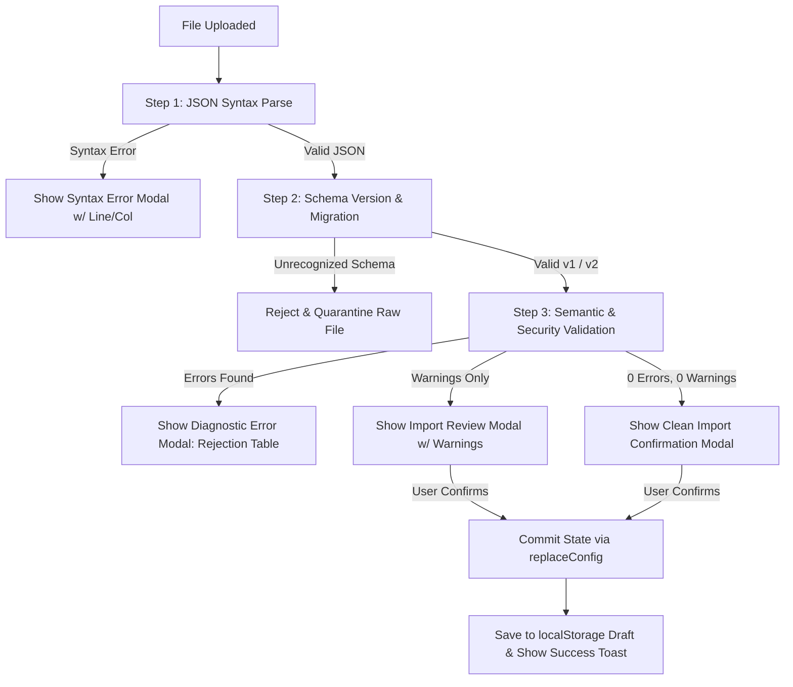

# PRD-002: V1.3 Configuration Validation Architecture & CMS Feedback Engine

- **Document Version:** 1.0.0
- **Status:** READY FOR TECHNICAL RESEARCH & ARCHITECT REVIEW
- **Author:** Maya (`maya-mt5yw3ix`), Product Manager
- **Stakeholders:** Kuldeep (`god` — Architect/Reviewer), Kelly (`kelly-mt5wqij5` — Research Lead), Sunanda (`sunanda-mt4huhsn` — CMS/Software Lead), Oscar (`oscar-mt4jlfpf` — UI/UX Lead), Imagine (`imagine-mt4lmpk8` — QA Lead), Peter (`peter-mt4lojhs` — Security Lead)
- **Target Release:** V1.3 (Phase 1.3 Roadmap)
- **Related ADRs & Research:** [ADR-001: Configuration Panel V2](file:///Users/kuldeeplodha/Desktop/Kuldeep%20Guided%20Projects/kuldeep-portfolio/docs/decisions/ADR-001-config-panel-v2.md), [Research: Config Panel V2](file:///Users/kuldeeplodha/Desktop/Kuldeep%20Guided%20Projects/kuldeep-portfolio/docs/research/config-panel-v2.md)

---

## 1. Executive Summary

### 1.1 Background & Problem Statement
In Phase 0 and V1.2 (`T-CMS-3`, `T-CMS-5`), the portfolio administration panel at `/admin` was upgraded with a unified state reducer, accessible entity CRUD controls (reordering, add, duplicate, delete), and a versioned storage envelope with quarantine fallback.

However, the validation UX remains tied to a legacy model:
1. **Save-Time Only Validation:** Validation only runs upon clicking "Save Draft" or "Export JSON", resulting in surprise validation failures after extensive editing.
2. **Monolithic Error Dump:** Errors are output as an unstructured, flat list of raw strings at the top of the form (`errors.map(...)`), requiring editors to manually locate the invalid input.
3. **No Inline Feedback:** Inputs, textareas, and select controls lack visual validation cues (`aria-invalid`, inline error messages, red highlight rings).
4. **Binary Severity:** The system treats every issue as a fatal error; there is no concept of non-blocking content quality warnings (e.g., missing descriptions, short summaries, or orphaned role references).
5. **Opaque Import Failures:** When an imported JSON configuration fails validation, the user receives a generic error string without a field-by-field diagnostic breakdown or path to resolution.

### 1.2 Objectives
1. **Real-Time Declarative Registry:** Transition from procedural validation to a modular, declarative rule registry producing structured validation issues (`ValidationIssue`).
2. **Two-Tier Issue Model:** Implement strict **Errors** (blocking save and export to guarantee site stability and security) and actionable **Warnings** (non-blocking quality guidance).
3. **Contextual & Accessible CMS Feedback:** Deliver inline field-level error messages, accessible ARIA attributes (`aria-invalid`, `aria-describedby`), dynamic section tab badges, and a jump-to-error summary banner.
4. **Fail-Closed Import/Export Protection:** Provide diagnostic import error reporting (identifying section, entity, field, and remediation steps) and prevent any invalid payload from corrupting the editor state or reaching production.
5. **Zero Runtime Dependencies:** Retain the project's zero-dependency footprint by utilizing pure TypeScript validation functions without external schema libraries (such as Zod).

---

## 2. Validation Model & Severity Taxonomy

Each validation rule evaluates a configuration node and generates a structured issue if the condition is not met:

```ts
export type ValidationSeverity = 'error' | 'warning'

export interface ValidationIssue {
  id: string                     // Unique issue ID (e.g. "exp-0-org-required")
  section: keyof PortfolioConfig // 'profile' | 'experience' | 'projects' | ...
  itemId?: string                // Entity UUID or array ID
  field?: string                 // Field name (e.g. "email", "githubUrl")
  severity: ValidationSeverity   // 'error' (blocking) | 'warning' (advisory)
  message: string                // Human-readable issue description
  remediation?: string           // Actionable hint for resolving the issue
}

export interface ValidationSummary {
  isValid: boolean               // true if errors.length === 0
  errors: ValidationIssue[]
  warnings: ValidationIssue[]
  errorCount: number
  warningCount: number
  issuesBySection: Record<string, ValidationIssue[]>
  issuesByEntity: Record<string, ValidationIssue[]>
  issuesByField: Record<string, ValidationIssue[]>
}
```

### 2.1 Severity Tiers & Behavior Matrix

| Feature | Error (`error`) | Warning (`warning`) | Valid / Pass |
| :--- | :--- | :--- | :--- |
| **Definition** | Breaking schema violation, empty required field, invalid URL/protocol, security hazard, or corrupt data. | Content quality issue, sub-optimal length, missing optional metadata, or orphaned reference. | Clean field satisfying all constraints. |
| **Blocks "Save Draft"** | **YES** — Blocks save; alerts user. | **NO** — Allowed with warning count advisory. | Allowed. |
| **Blocks "Export JSON"** | **YES** — Fail-closed; export prohibited. | **NO** — Allowed. | Allowed. |
| **Blocks Import** | **YES** — Rejects file; state untouched. | **NO** — Shows warning modal before user confirmation. | Allowed. |
| **Tab Navigation** | Red badge showing error count (`🔴 2`). | Amber badge showing warning count (`⚠️ 1`). | Displays standard entity count. |
| **Field Visual Style** | `border-red-500 focus:ring-red-400` + red error label below. | `border-amber-500 focus:ring-amber-400` + amber hint label below. | Standard slate border. |
| **Accessibility** | `aria-invalid="true"`, `aria-describedby="{id}-err"`. | `aria-invalid="false"`, `aria-describedby="{id}-warn"`. | No invalid flag. |

---

## 3. Field-by-Field Validation Specifications

Across all 11 configuration sections, validation rules are specified with explicit severity, boundaries, and remediation text.

### 3.1 Section: `profile`
Global personal and contact information rendered in navbar, hero, and metadata.

| Field | Severity | Condition / Rule | Error / Warning Message | Remediation |
| :--- | :--- | :--- | :--- | :--- |
| `name` | **Error** | Non-empty string; `trim().length >= 1`. Max 80 chars. | "Name is required." | Enter full personal name. |
| `navDisplayName` | **Error** | If provided, max 30 characters. | "Navbar name must be 30 characters or fewer." | Shorten display name to preserve single-line mobile navbar. |
| `navDisplayName` | **Warning** | If omitted or empty. | "Navbar name is empty; will fall back to full name." | Set a short name (e.g. 'K. Lodha') for compact mobile display. |
| `title` | **Error** | Non-empty string; `trim().length >= 1`. Max 120 chars. | "Professional title is required." | Provide a core title (e.g. 'Software Engineer'). |
| `location` | **Error** | Non-empty string; `trim().length >= 1`. | "Location is required." | Enter location (e.g. 'San Francisco, CA'). |
| `email` | **Error** | Non-empty, valid email syntax matching standard pattern `^[^\s@]+@[^\s@]+\.[^\s@]+$`. | "A valid email address is required." | Provide a valid contact email. |
| `phone` | **Warning** | If non-empty, must match phone format `^\+?[0-9\s\-()]{7,20}$`. | "Phone number format appears unusual." | Use standard international format (+1 ...). |
| `summary` | **Error** | Non-empty string; `trim().length >= 10`. | "Summary must be at least 10 characters." | Provide a concise professional summary. |
| `summary` | **Warning** | Length < 40 characters. | "Summary is very short." | Elaborate on key background and expertise. |
| `avatarUrl` | **Error** | If non-empty, must be a safe URI via `isValidSafeUrl` (relative `/...` or `http://` / `https://`). | "Invalid avatar URL. Must be a relative path or http(s) URL." | Use `/images/...` or a valid secure HTTPS link. |
| `links.linkedin` | **Error** | If non-empty, must satisfy `isValidSafeUrl` and not use forbidden protocols. | "Invalid LinkedIn URL." | Provide a valid HTTPS link. |
| `links.linkedin` | **Warning** | Non-empty but does not contain `linkedin.com/`. | "LinkedIn link does not appear to point to linkedin.com." | Verify the LinkedIn profile URL. |
| `links.github` | **Error** | If non-empty, must satisfy `isValidSafeUrl`. | "Invalid GitHub URL." | Provide a valid HTTPS link. |
| `links.github` | **Warning** | Non-empty but does not contain `github.com/`. | "GitHub link does not appear to point to github.com." | Verify the GitHub account URL. |

---

### 3.2 Section: `roles` (`Record<RoleId, RoleConfig>`)
Configuration for the 4 role perspectives (`software`, `ai`, `data`, `system`).

| Field | Severity | Condition / Rule | Message | Remediation |
| :--- | :--- | :--- | :--- | :--- |
| `roles` root | **Error** | Must be an object containing all 4 required role keys: `software`, `ai`, `data`, `system`. | "Missing required role definition(s)." | Ensure all 4 roles exist. |
| `role.label` | **Error** | Non-empty string; max 50 chars. | "Role label is required." | Name the role persona. |
| `role.themeId` | **Error** | Must match an existing key in `config.themes`. | "Invalid theme reference." | Link to a declared theme ID. |
| `role.hero.headline` | **Error** | Non-empty string; max 100 chars. | "Hero headline is required." | Enter headline for this role. |
| `role.hero.subtitle` | **Error** | Non-empty string; max 250 chars. | "Hero subtitle is required." | Enter supporting subtitle. |
| `role.hero.primaryCta` | **Error** | Non-empty string; max 50 chars. | "Primary CTA label is required." | Enter CTA text (e.g. 'View Projects'). |
| `role.resumeVariant` | **Error** | Must be one of: `'software'`, `'ai_ml'`, `'data_analyst'`. | "Invalid resume variant specified." | Select a valid resume variant. |
| `highlightedSkillIds` | **Warning** | Referenced skill ID does not exist in any `skills[].skills[].id`. | "Highlighted skill ID '{id}' not found." | Update reference or add the skill. |
| `highlightedProjectIds` | **Warning** | Referenced project ID does not exist in `projects[].id`. | "Highlighted project ID '{id}' not found." | Update reference or add the project. |
| `highlightedMetricIds` | **Warning** | Referenced metric ID does not exist in `metrics[].id`. | "Highlighted metric ID '{id}' not found." | Update reference or add the metric. |
| `experiencePriorityIds` | **Warning** | Referenced experience ID does not exist in `experience[].id`. | "Priority experience ID '{id}' not found." | Update reference or add experience. |

---

### 3.3 Section: `themes` (`Record<RoleId, ThemeTokens>`)
Visual themes associated with each perspective.

| Field | Severity | Condition / Rule | Message | Remediation |
| :--- | :--- | :--- | :--- | :--- |
| `themes` root | **Error** | Must contain all 4 role keys (`software`, `ai`, `data`, `system`). | "Missing theme for required role." | Restore default theme mapping. |
| Color tokens | **Error** | `background`, `surface`, `text`, `textMuted`, `accent`, `accentMuted`, `border` must be valid CSS color strings (hex `#...`, `rgb()`, `rgba()`, `hsl()`). | "Invalid CSS color token: '{value}'." | Provide a valid hex or rgb color code. |
| `heroGradient` | **Error** | Non-empty CSS gradient string. | "Hero gradient is required." | Provide a CSS linear/radial gradient definition. |
| `layoutVariant` | **Error** | Must be one of: `'terminal'`, `'neural'`, `'dashboard'`, `'hybrid'`. | "Invalid layout variant." | Select an authorized layout variant. |

---

### 3.4 Section: `experience` (`Experience[]`)

| Field | Severity | Condition / Rule | Message | Remediation |
| :--- | :--- | :--- | :--- | :--- |
| Array root | **Error** | Must be array with at least 1 entry. | "At least one experience entry is required." | Add work experience. |
| `id` | **Error** | Must be non-empty and unique across all experience items. | "Duplicate or missing experience ID." | Re-generate unique entity ID. |
| `organization` | **Error** | Non-empty string; max 100 chars. | "Organization name is required." | Provide company or institution name. |
| `role` | **Error** | Non-empty string; max 100 chars. | "Job title/role is required." | Provide role title. |
| `period` | **Error** | Non-empty string (e.g. '2022 – Present'). | "Employment period is required." | Provide date range. |
| `location` | **Error** | Non-empty string. | "Location is required." | Provide city, state, or 'Remote'. |
| `relevantRoles` | **Error** | Non-empty array containing valid `RoleId`s. | "At least one relevant role must be selected." | Check at least one role badge. |
| `responsibilities` | **Warning** | Empty array. | "No responsibilities listed." | Add bullet points describing day-to-day duties. |
| `achievements` | **Warning** | Empty array. | "No quantified achievements listed." | Add measurable impacts or metrics. |
| `achievement.text` | **Error** | Non-empty string if achievement is declared. | "Achievement text cannot be empty." | Enter achievement description. |
| `achievement.sourceVariants` | **Error** | Must contain at least one valid `ResumeVariant`. | "Achievement must map to at least one resume variant." | Select source resume variant(s). |
| `achievement.relevantRoles` | **Error** | Must contain at least one valid `RoleId`. | "Achievement must map to at least one role." | Select relevant role(s). |
| `technologies` | **Warning** | Empty array. | "No technologies tagged." | Add tech stack tags. |
| `imageUrl` | **Error** | If non-empty, must satisfy `isValidSafeUrl`. | "Invalid organization image URL." | Provide a valid safe path or URL. |
| `attachments[].label` | **Error** | Non-empty string if attachment exists. | "Attachment label is required." | Name the attachment. |
| `attachments[].url` | **Error** | Must satisfy `isValidSafeUrl`. | "Invalid attachment URL." | Provide safe URL. |

---

### 3.5 Section: `projects` (`Project[]`)

| Field | Severity | Condition / Rule | Message | Remediation |
| :--- | :--- | :--- | :--- | :--- |
| Array root | **Error** | Must be array with at least 1 entry. | "At least one project entry is required." | Add a portfolio project. |
| `id` | **Error** | Must be non-empty and unique across all projects. | "Duplicate or missing project ID." | Re-generate unique entity ID. |
| `title` | **Error** | Non-empty string; max 100 chars. | "Project title is required." | Provide project name. |
| `overview` | **Error** | Non-empty string; min 20 chars. | "Project overview must be at least 20 characters." | Provide a descriptive overview. |
| `period` | **Warning** | Empty string. | "Project timeframe/period is omitted." | Specify completion date or duration. |
| `problem` | **Warning** | Empty string. | "Problem statement is empty." | Detail the problem being solved. |
| `approach` | **Warning** | Empty string. | "Technical approach is empty." | Detail your architectural solution. |
| `result` | **Warning** | Empty string. | "Results/metrics are empty." | Add quantifiable outcomes. |
| `technologies` | **Warning** | Empty array. | "No technologies listed." | Add key tools and languages. |
| `githubUrl` | **Error** | If non-empty, must satisfy `isValidSafeUrl`. | "Invalid GitHub repository URL." | Provide valid HTTPS URL. |
| `githubUrl` | **Warning** | Non-empty but does not point to `github.com/`. | "Project link does not point to github.com." | Verify repository URL. |
| `relevantRoles` | **Error** | Non-empty array of valid `RoleId`s. | "Project must be assigned to at least one role." | Select relevant role(s). |
| `imageUrl` | **Error** | If non-empty, must satisfy `isValidSafeUrl`. | "Invalid project screenshot URL." | Provide safe image path. |
| `attachments[].url` | **Error** | Must satisfy `isValidSafeUrl`. | "Invalid attachment URL." | Provide safe URL. |

---

### 3.6 Section: `skills` (`SkillCategory[]`)

| Field | Severity | Condition / Rule | Message | Remediation |
| :--- | :--- | :--- | :--- | :--- |
| Array root | **Error** | Must be array with at least 1 category. | "At least one skill category is required." | Add a skill category. |
| `category.id` | **Error** | Must be non-empty and unique. | "Duplicate or missing skill category ID." | Re-generate unique category ID. |
| `category.name` | **Error** | Non-empty string; max 60 chars. | "Category name is required." | Name the category (e.g. 'Languages'). |
| `category.relevantRoles` | **Error** | Non-empty array of valid `RoleId`s. | "Skill category must have at least one role assigned." | Select relevant role(s). |
| `category.skills` | **Error** | Must be array with at least 1 skill item. | "Category must contain at least one skill." | Add a skill to this category. |
| `skill.id` | **Error** | Must be unique across all skills globally. | "Duplicate skill ID: '{id}'." | Ensure each skill has a unique ID. |
| `skill.name` | **Error** | Non-empty string; max 50 chars. | "Skill name is required." | Provide skill name. |
| `skill.relatedIds` | **Warning** | Referenced skill ID not found in any category. | "Related skill ID '{id}' does not exist." | Link to a valid skill ID. |

---

### 3.7 Section: `education` (`Education[]`)

| Field | Severity | Condition / Rule | Message | Remediation |
| :--- | :--- | :--- | :--- | :--- |
| Array root | **Error** | Must be array with at least 1 entry. | "At least one education entry is required." | Add an educational institution. |
| `id` | **Error** | Must be unique. | "Duplicate education ID." | Re-generate unique ID. |
| `degree` | **Error** | Non-empty string; max 100 chars. | "Degree or credential name is required." | Enter degree title. |
| `institution` | **Error** | Non-empty string; max 100 chars. | "Institution name is required." | Enter university/school name. |
| `period` | **Error** | Non-empty string. | "Attendance period is required." | Provide years of study. |
| `location` | **Error** | Non-empty string. | "Location is required." | Enter city, state, or country. |
| `gpa` | **Warning** | If present and > 4.0 (assuming 4.0 scale) or malformed. | "GPA format appears unusual." | Verify GPA format. |

---

### 3.8 Section: `certifications` (`Certification[]`)

| Field | Severity | Condition / Rule | Message | Remediation |
| :--- | :--- | :--- | :--- | :--- |
| `id` | **Error** | Must be unique. | "Duplicate certification ID." | Re-generate unique ID. |
| `name` | **Error** | Non-empty string; max 100 chars. | "Certification name is required." | Enter certificate title. |
| `issuer` | **Error** | Non-empty string; max 100 chars. | "Issuing organization is required." | Enter issuer (e.g. 'AWS'). |
| `sourceVariants` | **Error** | Non-empty array of valid `ResumeVariant`s. | "At least one resume variant must be selected." | Select resume variant(s). |
| `url` | **Error** | If non-empty, must satisfy `isValidSafeUrl`. | "Invalid certification verification URL." | Provide valid HTTPS verification link. |
| `date` | **Warning** | Empty string. | "Certification issuance date is omitted." | Add date achieved. |

---

### 3.9 Section: `research` (`Research[]`)

| Field | Severity | Condition / Rule | Message | Remediation |
| :--- | :--- | :--- | :--- | :--- |
| `id` | **Error** | Must be unique. | "Duplicate research ID." | Re-generate unique ID. |
| `title` | **Error** | Non-empty string; max 120 chars. | "Research title is required." | Enter research topic or paper title. |
| `description` | **Error** | Non-empty string; min 20 chars. | "Research description must be at least 20 characters." | Describe the research scope and methods. |
| `status` | **Error** | Non-empty string. | "Research status is required." | Enter status (e.g. 'Published', 'In Progress'). |

---

### 3.10 Section: `metrics` (`Metric[]`)

| Field | Severity | Condition / Rule | Message | Remediation |
| :--- | :--- | :--- | :--- | :--- |
| Array root | **Error** | Must contain at least 1 metric. | "At least one key metric is required." | Add an impactful business metric. |
| `id` | **Error** | Must be unique. | "Duplicate metric ID." | Re-generate unique ID. |
| `label` | **Error** | Non-empty string; max 80 chars. | "Metric label is required." | Describe what is measured (e.g. 'Latency Reduction'). |
| `value` | **Error** | Non-empty string; max 20 chars. | "Metric value is required." | Provide value (e.g. '75%', '10k+ users'). |
| `sourceVariants` | **Error** | Non-empty array of valid `ResumeVariant`s. | "Metric must be associated with at least one resume variant." | Select resume variant(s). |
| `relevantRoles` | **Error** | Non-empty array of valid `RoleId`s. | "Metric must be assigned to at least one role." | Select relevant role(s). |

---

### 3.11 Section: `aiKnowledge` (`AIKnowledgeEntry[]`)
Grounding data for the client-side "Ask Kuldeep" interactive assistant.

| Field | Severity | Condition / Rule | Message | Remediation |
| :--- | :--- | :--- | :--- | :--- |
| Array root | **Error** | Must contain at least 1 entry. | "At least one AI knowledge entry is required." | Add an AI grounding entry. |
| `id` | **Error** | Must be unique. | "Duplicate AI knowledge entry ID." | Re-generate unique ID. |
| `answer` | **Error** | Non-empty string; min 10 chars. | "Knowledge answer must be at least 10 characters." | Provide a factual, grounded response. |
| `answer` | **Warning** | Length > 600 chars. | "Answer is very long for a quick AI chat response." | Consider tightening response for readability. |
| `questionPatterns` | **Error** | Non-empty array of strings. | "At least one question pattern is required." | Add search queries users might ask. |
| `questionPatterns[i]`| **Error** | Non-empty string. | "Question pattern cannot be empty." | Provide trigger phrase. |
| `questionPatterns[i]`| **Warning** | Pattern length < 3 chars or single generic word (e.g. 'the', 'a'). | "Question pattern '{pattern}' is too broad." | Use multi-word keywords for accurate matching. |
| `tags` | **Warning** | Empty array. | "No search tags assigned to this entry." | Add tags for faceted retrieval. |
| `source` | **Error** | Non-empty string. | "Source citation is required." | Cite source (e.g. 'Resume', 'Portfolio'). |

---

## 4. CMS Error & Warning Handling UX Specification

### 4.1 Real-Time Debounced Engine
1. **Memoized Evaluation:** A pure validator function `validateConfigRegistry(config): ValidationSummary` evaluates the draft state.
2. **Debounce Behavior:** In the UI, the validation runs synchronously in `useMemo` upon state updates. Because the entire configuration is <100 KB, recomputing 50–100 pure validation checks takes under 2ms, introducing zero perceptible typing lag.
3. **Lookup Maps for O(1) Rendering:** `ValidationSummary` provides index maps:
   - `issuesByField[fieldKey]` -> for instant inline field queries.
   - `issuesByEntity[entityId]` -> for highlighting invalid cards/items in lists.
   - `issuesBySection[sectionKey]` -> for tab badges.

### 4.2 Inline Field Feedback
Every input field (`input`, `textarea`, `select`, media pickers) reflects its validation state:
- **Error State:**
  - Container border: `border-red-500 focus:border-red-400 focus:ring-red-400/30`.
  - Icon: Red warning icon (`⚠️`) rendered at the trailing edge of the input.
  - Accessibility: `aria-invalid="true"`, `aria-describedby="{fieldId}-error"`.
  - Helper message: `<p id="{fieldId}-error" className="mt-1 text-xs text-red-400 font-medium" role="alert">{message}</p>`.
- **Warning State:**
  - Container border: `border-amber-500/80 focus:border-amber-400 focus:ring-amber-400/30`.
  - Icon: Amber info icon (`ℹ️`).
  - Accessibility: `aria-invalid="false"`, `aria-describedby="{fieldId}-warning"`.
  - Helper message: `<p id="{fieldId}-warning" className="mt-1 text-xs text-amber-300 font-medium">{message}</p>`.
- **Pass State:**
  - Standard neutral border (`border-slate-700`).

### 4.3 Navigation & Tab Badges
Sidebar navigation items and mobile horizontal pills will display dynamic badge counters:
- **Section has Errors:** Red badge pill displaying error count: `<span className="ml-auto rounded-full bg-red-500/20 px-2 py-0.5 text-xs font-semibold text-red-400 border border-red-500/30">{errorCount} err</span>`.
- **Section has Warnings Only:** Amber badge pill: `<span className="ml-auto rounded-full bg-amber-500/20 px-2 py-0.5 text-xs font-semibold text-amber-300 border border-amber-500/30">{warningCount} warn</span>`.
- **Clean Section:** Shows default entity count badge (`10`, `6`, etc.).

### 4.4 Top Validation Status Banner
Replacing the current raw bulleted string dump, a rich, responsive status bar sits at the top of the editing canvas:
- **When Errors Exist:**
  - Alert banner with red accent: `"Configuration Incomplete: {N} blocking error(s) found across {M} section(s)."`.
  - Interactive "Jump to Next Error" button that switches tabs and focuses the invalid field.
  - Collapsible drawer listing all active errors grouped by section, clicking any error immediately focuses that input.
- **When Warnings Exist (0 Errors):**
  - Informational amber banner: `"{N} quality recommendation(s). Draft is safe to save and export."` with a toggle to review suggestions.
- **When Clean (0 Errors, 0 Warnings):**
  - Subtle green check indicator: `"All sections valid. Ready to export."`.

### 4.5 Button Gating & Safeguards
- **"Save Draft" Button:**
  - If Errors exist: Button is disabled, or clicking triggers a modal: `"Cannot Save Draft: Fix {N} validation error(s) before saving."`.
  - If Warnings exist: Fully enabled; toast indicates: `"Draft saved with {N} quality recommendations."`.
- **"Export JSON" Button:**
  - Strict gating: Disabled when `errorCount > 0`.
  - Tooltip: `"Export is disabled until all blocking errors are resolved."`.

---

## 5. Import & Export Lifecycle Specification

### 5.1 Export Flow (Fail-Closed)
1. **Pre-flight Check:** User clicks "Export JSON". System invokes `validateFullConfig(config)`.
2. **Failure Branch:** If any errors are found:
   - Export execution is immediately aborted.
   - User is alerted via modal and focus is moved to the first invalid field.
   - Zero files are downloaded.
3. **Success Branch:** If valid:
   - Configuration is wrapped in the versioned envelope:
     ```json
     {
       "schemaVersion": 2,
       "savedAt": "2026-09-04T22:30:00.000Z",
       "config": { ... }
     }
     ```
   - Triggers clean browser download of `portfolio-config.json`.
   - Displays toast: `"Configuration exported successfully ({size} KB)."`.

### 5.2 Import Flow (Detailed Diagnostic Reporting)
When a user uploads a configuration JSON file via "Import JSON", the system executes a 4-step intake pipeline:



#### Diagnostic Error Modal (On Import Failure)
Instead of throwing a generic error string, import failures present an actionable diagnostic dialog:
- **Header:** "Import Failed: {N} Errors Detected in Uploaded File"
- **Status:** "Your current workspace has NOT been modified. No changes were made."
- **Issue Table:**
  - Columns: Section | Item / ID | Field | Problem | Required Remediation
  - Example: `projects | proj-2 | githubUrl | "javascript:alert(1)" | Must be a valid http(s) URL`
- **Action:** "Download Error Log (.txt)" button allowing users to review issues offline.

#### Quarantine Recovery
- If an unversioned or malformed draft was automatically quarantined in `localStorage` (`kuldeep-portfolio-config-draft-corrupt`):
  - A prominent banner appears: `"Corrupted draft recovered from storage. Bundled default loaded."`
  - Actions provided:
    1. **"Inspect Corrupted Payload":** Opens a read-only modal showing the raw JSON with highlighted syntax/schema gaps.
    2. **"Discard Quarantine":** Purges the quarantine key and hides banner.

---

## 6. User Stories & Acceptance Criteria

### User Story 1: Inline Real-Time Field Feedback
**As an** administrator updating my resume profile in the CMS,  
**I want** immediate visual feedback on the field I am editing,  
**So that** I know if my input is valid without waiting to click Save.

- **Scenario 1.1: Invalid email address entered**
  - **Given** the user is on the `/admin` Profile tab.
  - **When** the user types `kuldeep.lodha` into the Email input and blurs or pauses typing.
  - **Then** the Email input border turns red (`border-red-500`).
  - **And** an error message "A valid email address is required." appears below the input.
  - **And** the input has `aria-invalid="true"` and `aria-describedby="profile-email-error"`.
  - **And** the Profile sidebar tab displays a red badge `🔴 1`.

- **Scenario 1.2: Valid email entered**
  - **Given** the Email input is in an invalid error state.
  - **When** the user appends `@example.com`.
  - **Then** the red error border and error message disappear.
  - **And** `aria-invalid` becomes `"false"`.
  - **And** the Profile tab red badge count decrements or clears.

---

### User Story 2: Prevention of Dangerous URLs & Media Injection
**As a** portfolio owner concerned with security,  
**I want** all URL inputs (avatars, LinkedIn, GitHub, project links, attachment URLs) strictly validated against safe protocols,  
**So that** no malicious `javascript:` or `data:` URIs can be saved into drafts or published to GitHub Pages.

- **Scenario 2.1: Disallowing script schemes**
  - **Given** the user is editing a Project in `/admin`.
  - **When** the user enters `javascript:stealToken()` into `githubUrl` or `attachments[0].url`.
  - **Then** an immediate blocking Error is flagged: "Invalid URL. Must use http://, https://, or relative path."
  - **And** the "Export JSON" and "Save Draft" buttons become disabled.

---

### User Story 3: Non-Blocking Quality Warnings
**As a** portfolio administrator,  
**I want** advisory warnings on incomplete content (e.g. empty descriptions, unassigned roles),  
**So that** I am guided toward high-quality presentation without being blocked from saving my draft.

- **Scenario 3.1: Saving draft with quality warnings**
  - **Given** all required fields are filled, but a Project has no `problem` or `result` text.
  - **When** the user navigates to the Projects tab.
  - **Then** the Projects tab displays an amber badge `⚠️ 2`.
  - **And** amber helper text appears below the Problem and Result textareas.
  - **When** the user clicks "Save Draft".
  - **Then** the draft saves successfully to `localStorage`.
  - **And** a toast indicates: "Draft saved. 2 recommendations remaining."

---

### User Story 4: Diagnostic Import Failure Reporting
**As an** administrator importing an external JSON configuration,  
**I want** a clear diagnostic report if the file is invalid,  
**So that** I know exactly which lines to fix without corrupting my current panel state.

- **Scenario 4.1: Importing invalid configuration**
  - **Given** the user has a valid working draft loaded.
  - **When** the user selects a JSON file containing an empty experience role and an invalid URL.
  - **Then** the import fails closed without altering the active configuration.
  - **And** an Import Diagnostic Modal opens listing the exact errors, sections, and values.
  - **And** the user's active editor draft remains completely intact.

---

### User Story 5: Cross-Reference & ID Integrity Safeguards
**As an** administrator deleting an entity or managing roles,  
**I want** the system to detect and warn if another section references the deleted entity,  
**So that** I do not publish broken highlights or orphan references.

- **Scenario 5.1: Orphaned project reference warning**
  - **Given** `roles.software.highlightedProjectIds` contains `'proj-old-app'`.
  - **When** the user deletes `'proj-old-app'` or imports a file missing that project ID.
  - **Then** a warning is surfaced on the Role Pages tab: "Highlighted project ID 'proj-old-app' not found in Projects."
  - **And** an option "Remove Orphaned Reference" is provided.

---

## 7. Non-Functional Requirements

1. **Performance:**
   - Full configuration validation must execute in `< 5ms` for a typical portfolio configuration (<100 KB).
   - Typing in form controls must maintain 60 fps (zero keystroke lag).
2. **Zero Runtime Dependencies:**
   - The validation engine must be written in standard TypeScript using vanilla functions. No external libraries (`zod`, `yup`, `joi`) may be installed.
3. **Accessibility (WCAG 2.1 AA):**
   - All input error states must announce via screen readers using `role="alert"` or `aria-describedby`.
   - Color cannot be the sole conveyor of error states; all invalid inputs must pair color with icons and descriptive text.
   - Visual contrast of error (`#ef4444`) and warning (`#f59e0b`) text on dark backgrounds (`#0f172a`, `#1e293b`) must meet the `4.5:1` AA contrast ratio.
4. **Security & Data Integrity:**
   - `isValidSafeUrl` must strictly enforce protocol allowlists (`http:`, `https:`, relative `/`) and reject case variations or whitespace bypasses (`JAVASCRIPT:`, `\njavascript:`).
   - Strict fail-closed posture across all import, draft load, and export boundaries.

---

## 8. Multi-Agent Implementation & Review Plan

| Agent | Role | Responsibilities for V1.3 Validation |
| :--- | :--- | :--- |
| **Maya** (`maya-mt5yw3ix`) | Product Manager | Authored PRD; defines scope, field specs, UX behaviors, and acceptance criteria. Coordinates review and milestone sign-off. |
| **Kelly** (`kelly-mt5wqij5`) | Researcher | Conducts technical research on optimal zero-dependency validation registry pattern (`src/lib/config/validationRegistry.ts`), O(1) index caching, and debounce strategies. |
| **Kuldeep** (`god`) | Head / Architect | Reviews PRD and Kelly's technical research; approves ADR/architectural integration; final PR review and merge gate. |
| **Sunanda** (`sunanda-mt4huhsn`) | Software Lead | Implements validation registry, connects validation summary to `AdminPage.tsx`, refactors `exportImport.ts`, and updates unit test suites (`T-CMS-6`). |
| **Oscar** (`oscar-mt4jlfpf`) | UI/UX Lead | Builds inline field error wrappers, warning styles, section tab badge pills, error status bar, and diagnostic import modal. |
| **Imagine** (`imagine-mt4lmpk8`) | QA Lead | Builds comprehensive regression test suite (100% field coverage, invalid import fixtures, keyboard navigation, and axe accessibility scans). |
| **Peter** (`peter-mt4lojhs`) | Security Lead | Conducts security audit on URL validation, fuzzing against XSS vectors, protocol bypasses, and quarantine containment. |

---

## 9. Appendix: Existing Validation Rules to Port Verbatim

The following existing checks in `src/lib/config/exportImport.ts` must be preserved verbatim in the registry to guarantee 100% backward compatibility:
1. `Profile`: Name required, email required + `@` check, safe `avatarUrl`, safe `links.linkedin`, safe `links.github`.
2. `Experience`: Organization required, role required, period required, safe `imageUrl`, safe `attachments[].url`.
3. `Projects`: Title required, overview required, safe `imageUrl`, safe `githubUrl`, safe `attachments[].url`.
4. `Skills`: Category name required, skills array required, each skill name required.
5. `Education`: Degree required, institution required, period required.
6. `Certifications`: Name required, issuer required, safe `url`.
7. `Research`: Title required, description required.
8. `Metrics`: Label required, value required.
9. `AI Knowledge`: Answer required, questionPatterns array with >=1 non-empty pattern.
10. `Roles & Themes`: Objects must be present and valid.
